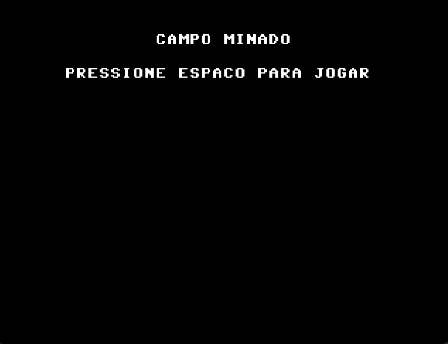
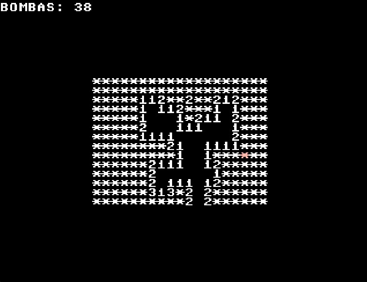
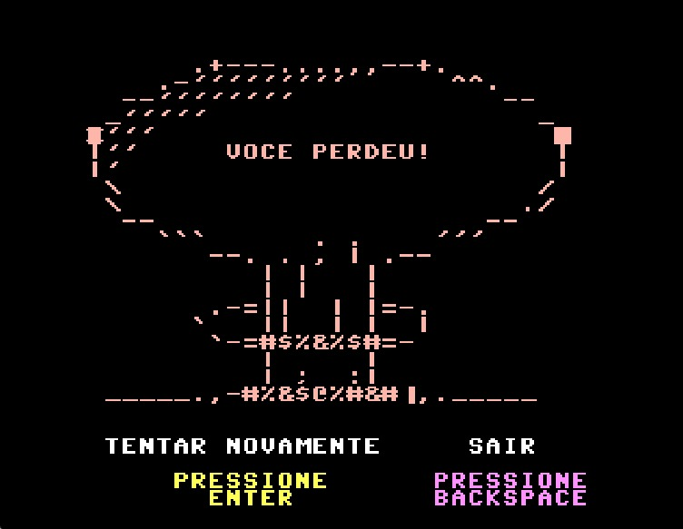

# Jogo-Pratica-em-Org-e-Arq-Comp
Jogo feito em assembly feito pra rodar no processador ICMC para a disciplina de Prática em Organização e Arquitetura de Computadores no ICMC-USP

### Membros do Grupo

- Rafael Pavon Diesner (16898096)
- Nicolas José Mota (16990096)
- Eric Costa Lopes (17070779)
- Gabriel Perlati Souza (17071123)

# Minesweeper
O projeto consiste no desenvolvimento do jogo Campo Minado em assembly, usando a arquitetura do processador-ICMC (https://github.com/simoesusp/Processador-ICMC). Não foram criadas instruções novas pois as que já haviam no processador original eram suficientes pro nosso jogo.

O jogo consiste em um tabuleiro com 38 bombas espalhadas e o objetivo do jogador é liberar todos os espaços do tabuleiro que não tenham bombas. Quando se clica em um espaço que não tem bombas, aparece naquele espaço um indicador de quantas bombas tem nos espaços imediatamente ao lado do que foi clicado, considerando lados e diagonais.

### Comandos

Espaço -> libera o espaço indicado pelo marcador vermelho

F -> marca um espaço com uma bandeira (pra você marcar pra si mesmo que acha que tem uma bomba ali)

W -> se move pra cima

A -> se move pra esquerda

S -> se move pra baixo

D -> se move pra direita

# Fotos

Tela de início do jogo

Tela durante uma partida

Tela de derrota

# Vídeo com demosntração do jogo

https://youtu.be/7Dzx-N7HG-E
